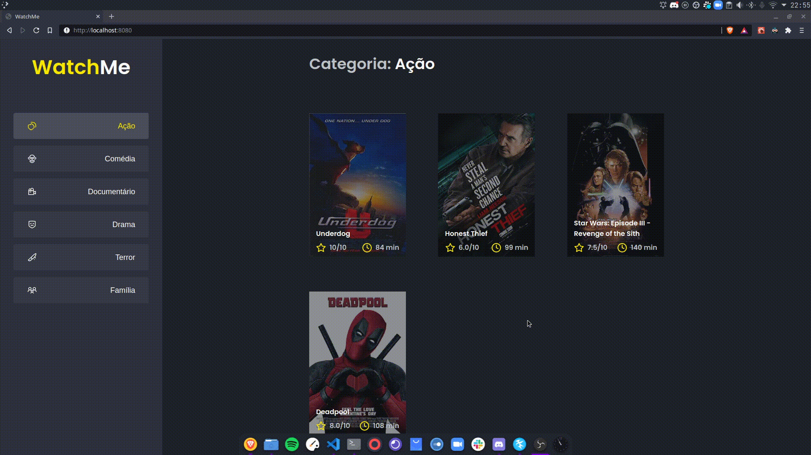

<div align="center">
  
</div>

<h1 align="center"> 🚀 RocketSeat - Ignite ReactJS </h1>

<h2 align="center"> Desafio 02 - Componentizando a aplicação</h2>

<p align="center">
  <a href="https://rocketseat.com.br">
    
  </a>
  
  
  
  <a href="https://github.com/claybson">
    
  </a>
</p>

## 💻 Sobre o desafio
Nesse desafio, você deverá criar uma aplicação para treinar o que aprendeu até agora no ReactJS
Essa será uma aplicação onde o seu principal objetivo é refatorar uma página para listagem de filmes de acordo com gênero. 

## 🧰 Tecnologias
* ReactJS
* TypeScript
* JavaScript
* HTML
* SASS
* Axios
* JSON Server

## ⚙️ Instalação e execução
```bash
# Abra o terminal e clone o repositório
git clone https://github.com/claybson/ignite-chapter-01-desafio-componentizando-a-aplicacao.git

# Entre na pasta
cd ignite-chapter-01-desafio-componentizando-a-aplicacao

# Instale as dependências
yarn install

# Inicie a Fake API
yarn server

# Rode a aplicação
yarn dev

# Acesse o projeto no seu navegador
http://localhost:8080 no seu navagador
```
## 🔥 Funcionamento da aplicação
Está com dúvidas (ou curioso 👀) para ver como deve ficar a aplicação ao final do desafio? Deixamos abaixo um vídeo mostrando as principais funcionalidades que você deve implementar para te ajudar (ou matar sua curiosidade 👀).
<div align="center">
  
</div>

## 📙 Referência
<a href="https://www.notion.so/Desafio-02-Componentizando-a-aplica-o-b9f0f025c95b437699d0c3115f55b0f1">Desafio 02 - Componentizando a aplicação</a>

## :memo: Licença

Esse projeto está sob a licença MIT. Veja o arquivo [LICENSE](/LICENSE) para mais detalhes.

Desenvolvido com :green_heart: por [Claybson Bastos](https://github.com/claybson) 

[](https://www.linkedin.com/in/claybson-araujo/) 